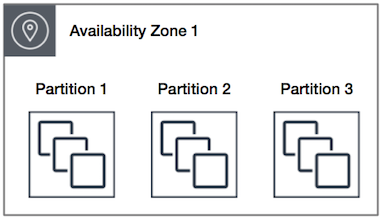
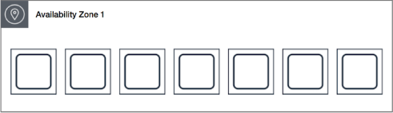

# Cluster Placement Groups

## 🧩 Định nghĩa
- Là nhóm logic các EC2 instance nằm trong **cùng một Availability Zone**.
- **Không bị giới hạn bởi rack đơn lẻ**.
- Có thể mở rộng sang **VPC peering trong cùng Region**.
- Tận dụng **băng thông cao** và **độ trễ thấp** trong cùng segment mạng.

## 🚀 Trường hợp sử dụng
Phù hợp với ứng dụng cần:
- **Độ trễ mạng thấp**
- **Băng thông cao**
- **Giao tiếp nội bộ giữa các instance nhiều**

➡️ **Ví dụ**: HPC, Big Data, phân tích thời gian thực.

## 💡 Khuyến nghị khi tạo instance
- Dùng **một lệnh launch duy nhất** để tạo toàn bộ số instance.
- Dùng **cùng loại instance** trong cả group.
- Chọn instance hỗ trợ **enhanced networking** để có hiệu suất tối đa.

## ⚠️ Lưu ý về năng lực phần cứng
- **Thêm instance sau** có thể dẫn đến lỗi **insufficient capacity**.
- Khi **stop → start lại** một instance:
  - Nó vẫn thuộc placement group.
  - **Start có thể thất bại** nếu không còn đủ capacity.

➡️ **Mẹo xử lý lỗi capacity**:
- **Stop toàn bộ** các instance trong group.
- **Start lại tất cả** → hệ thống có thể di chuyển instance sang phần cứng đủ tài nguyên.

## Cluster Placement Group Rules

### ✅ Supported Instance Types
- **Current generation** (trừ):  
  - Burstable performance instances (e.g., T2)  
  - Mac1 instances  
  - M7i-flex instances  
- **Previous generation**:  
  - A1, C3, C4, I2, M4, R3, R4

### ⚠️ Placement Limitations
- Cluster placement groups **cannot span multiple Availability Zones**.
- **Maximum network throughput** between two instances is limited by the **slower instance**.
- For **high-throughput apps**, choose instances with appropriate network capabilities.

### 🔗 Enhanced Networking Rules
- Inside a cluster placement group:
  - **Up to 10 Gbps** for **single-flow traffic**
- Outside a placement group:
  - **Up to 5 Gbps** for **single-flow traffic**

### 🪣 S3 Traffic Bandwidth
- Access to S3 buckets (in same Region) via:
  - Public IPs or  
  - VPC Endpoints  
  → Uses **full instance aggregate bandwidth**

### 🧩 Mixed Instance Types
- You **can** launch multiple instance types into a cluster placement group.
- ⚠️ Reduces chance of capacity availability.
- ✅ **Recommended**: Use **same instance type** for all.

### 📦 Capacity Reservation
- ✅ Recommended: Use **On-Demand Capacity Reservation** in the placement group.
- ❌ **Zonal Reserved Instances** do **not** reserve capacity in a placement group.

### 🌐 External Traffic Limits
- **Internet** & **AWS Direct Connect** traffic is limited to **5 Gbps** per instance in a cluster placement group.

# Partition placement groups

  

## 🎯 Mục tiêu
Giảm thiểu rủi ro lỗi phần cứng đồng thời ảnh hưởng nhiều instance.

## 🧱 Cấu trúc
- Một **Partition Placement Group** được chia thành nhiều **partition logic**.
- Mỗi partition:
  - Sử dụng **rack riêng biệt** (với nguồn điện và mạng riêng).
  - **Không chia sẻ** rack với các partition khác → giúp cô lập lỗi phần cứng.

## 📊 Trường hợp sử dụng
- Phù hợp với **workload phân tán và nhân bản lớn**, ví dụ:
  - **HDFS**, **HBase**, **Cassandra**
- Có thể:
  - EC2 sẽ tự phân bổ đều instance vào các partition.
  - Hoặc bạn có thể chỉ định **partition cụ thể** khi launch để kiểm soát tốt hơn.

## 🌍 Khả năng phân vùng theo AZ
- Một placement group có thể có partition tại **nhiều Availability Zone** trong cùng một Region.
- Mỗi AZ hỗ trợ **tối đa 7 partition**.
- Giới hạn số instance phụ thuộc vào **hạn mức tài khoản**.

## 👁️ Visibility & Topology-aware
- Có thể xem **instance thuộc partition nào**.
- Dữ liệu này có thể chia sẻ với ứng dụng **có khả năng nhận biết topology**, ví dụ:
  - HDFS, HBase, Cassandra → để sao lưu thông minh, tăng độ **sẵn sàng** và **bền vững dữ liệu**.

## ⚠️ Giới hạn tài nguyên
- Nếu thiếu phần cứng độc lập khi khởi tạo/khởi động instance → yêu cầu có thể **thất bại**.
- EC2 có thể cấp phát thêm phần cứng sau → thử lại sau đó.

## Partition Placement Group – Rules & Limitations

### 📌 Giới hạn kỹ thuật
- Tối đa **7 partitions / Availability Zone**.
- Với **Dedicated Instances**: chỉ **2 partitions / AZ**.
- Số lượng instance phụ thuộc vào **giới hạn tài khoản** (account limits).

### ⚙️ Phân phối instance
- EC2 **cố gắng phân phối đều** các instance vào các partition.
- ❗ Không đảm bảo phân phối hoàn toàn đồng đều.

### 🚫 Capacity Reservation
- **Capacity Reservations** **không** thể giữ chỗ (reserve capacity) trong partition placement group.

# Spread Placement Groups
# What is ALB

  

## 🧩 Định nghĩa
- Nhóm các EC2 instance được đặt trên **phần cứng riêng biệt** (distinct hardware).
- Mục tiêu: **giảm thiểu rủi ro lỗi đồng thời** do chia sẻ cùng thiết bị vật lý.

## 🎯 Trường hợp sử dụng
- Phù hợp với các ứng dụng có **số lượng nhỏ các instance quan trọng** cần cách ly phần cứng.
- Thích hợp để:
  - **Trộn loại instance**
  - **Tạo instance theo thời gian (không đồng loạt)**

## 🧱 Các cấp độ spread
### 🔹 Rack Level Spread (Dùng cho AWS Region & Outposts)
- Mỗi AZ: **tối đa 7 instance / group**
- Mỗi instance ở trên **rack riêng biệt** (có mạng và nguồn riêng).
- Có thể **trải rộng nhiều AZ** trong cùng Region.

### 🔹 Host Level Spread (Chỉ dùng cho AWS Outposts)
- Instance được trải đều trên **host riêng biệt**.
- Giới hạn số lượng tùy thuộc vào **số host trong Outposts**.

## ⚠️ Lưu ý khi khởi tạo
- Nếu không đủ phần cứng độc lập → **yêu cầu sẽ thất bại**.
- EC2 có thể cấp phát phần cứng riêng biệt dần theo thời gian → thử lại sau.

## Spread Placement Group – Rules & Limitations

### 📌 Rack Level Spread (Region & Outposts)
- Tối đa **7 instance / Availability Zone / group**
  - Ví dụ: Region có 3 AZ → tổng cộng **21 instance / group**
- Nếu cần >7 instance / AZ:
  - Dùng **nhiều spread placement group**
  - ⚠️ Không đảm bảo instance giữa các group được trải đều

### 🚫 Hạn chế
- **Không hỗ trợ Dedicated Instances**
- **Capacity Reservations** **không** giữ chỗ trong spread placement group

### 🏠 Host Level Spread (Chỉ với AWS Outposts)
- Chỉ khả dụng trên **AWS Outposts**
- Số lượng instance phụ thuộc vào **số lượng host trong Outposts**

### 📌 Với Outposts
- Rack level: Số instance phụ thuộc vào **số rack có sẵn**

