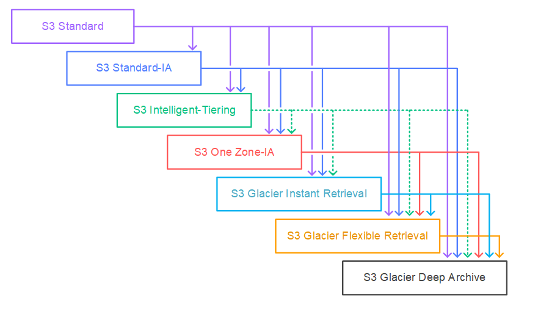

# 🗄️ S3 Lifecycle – Transition Considerations

Amazon S3 lifecycle rules enable automatic transitioning of objects to different storage classes to optimize cost and access. Here are key considerations:

---

## ✅ Supported Transitions

- **Waterfall model**: e.g., STANDARD → STANDARD‑IA → GLACIER → DEEP-ARCHIVE.  
- All storage classes (except Standard) can move to Glacier/Deep Archive; you cannot transition **back** via lifecycle rules :contentReference[oaicite:1]{index=1}.

  

---

## ⏱️ Size & Age Constraints

- **Small objects (< 128 KB)** are *not* transitioned by default, to avoid high request costs :contentReference[oaicite:2]{index=2}.
- **STANDARD‑IA/ONEZONE‑IA** require objects to be ≥ 30 days old before transitioning :contentReference[oaicite:3]{index=3}.
- Minimum storage durations (e.g., 30d for IA, 90d for Glacier IR) apply; early transitions incur prorated charges :contentReference[oaicite:4]{index=4}.

---

## ⚙️ Glacier & Deep Archive Specifics

- Objects transitioned to Glacier Flexible Retrieval or Deep Archive are **not real-time accessible**; must be **restored** for a limited duration :contentReference[oaicite:5]{index=5}.
- Glacier Flexible → Deep Archive can be done via lifecycle; reverse requires manual restore + copy :contentReference[oaicite:6]{index=6}.
- Glacier Deep Archive is **one-way only** via lifecycle :contentReference[oaicite:7]{index=7}.
- Archived objects remain in S3 (not in separate Glacier service) and **stay encrypted** during transitions :contentReference[oaicite:8]{index=8}.

---

## 💰 Cost Considerations

- Each transition is a **request cost**, so avoid for small objects or mass transitions :contentReference[oaicite:9]{index=9}.
- **Overhead metadata**: Glacier classes add 8 KB (S3 pricing) + 32 KB (Glacier rates) per object :contentReference[oaicite:10]{index=10}.
- **Minimum durations** (90d for Glacier Flexible, 180d for Deep Archive) apply; early deletions result in charges :contentReference[oaicite:11]{index=11}.
- **Restore fees** apply when accessing archived data :contentReference[oaicite:12]{index=12}.
- Transitions are **asynchronous**—billing changes occur when rule is triggered, not when completed :contentReference[oaicite:13]{index=13}.

---

## ⚠️ Rule Interactions & Edge Cases

- **Multiple rules/dependencies**: 
  - Expiration > transition > delete marker precedence :contentReference[oaicite:14]{index=14}.
  - Glacier transition takes precedence over IA if both apply same day :contentReference[oaicite:15]{index=15}.
- Updates/deletions of lifecycle rules take effect **after a short delay**; existing scheduled operations may still occur :contentReference[oaicite:16]{index=16}.
- Actions are **asynchronous**, and billing changes may happen before physical actions :contentReference[oaicite:17]{index=17}.

---

## 📝 Best Practices

- Use **filters** to exclude small objects (< 128 KB) or to segregate by prefix/tag to reduce unnecessary transitions :contentReference[oaicite:18]{index=18}.
- Design tiering: e.g., STANDARD → IA after 30 days → GLACIER after 90 days → expiration after long-term retention :contentReference[oaicite:19]{index=19}.
- Monitor transitions via **S3 server logs**, events, or inventory reports :contentReference[oaicite:20]{index=20}.

---

## 📦 Summary Table

| Consideration               | Recommendation                                         |
|----------------------------|--------------------------------------------------------|
| Object size <128 KB        | Skip transitions by default                            |
| Minimum age for IA classes | ≥ 30 days                                              |
| Glacier class durations    | ≥ 90 days (Flexible), ≥ 180 days (Deep Archive)        |
| Archived access            | Requires restore and incurs request + storage charges |
| Rule conflicts             | Expiration > transition; Glacier > IA                 |
| Billing vs execution lag   | Billing on rule trigger; actions later asynchronously |

